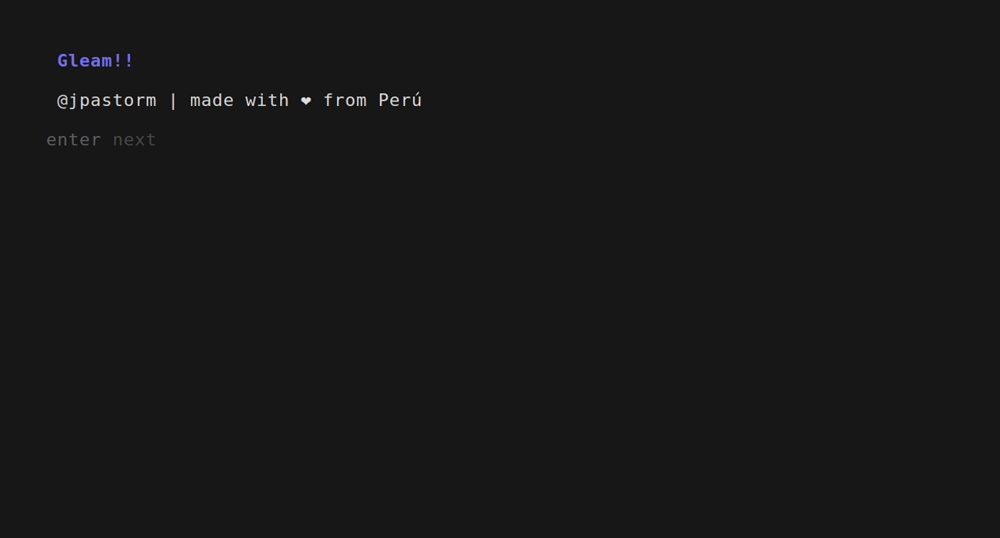

# Gleam

Gleam is a command-line tool designed to streamline the process of cloning both public and private
repositories, including those from organizations, using a secret token.



## Features

- Clone public repositories effortlessly.
- Clone private repositories securely using a secret token.
- Clone repositories from organizations with ease.

## Installation

1. Clone this repository:

    ```bash
   go install github.com/jpastorm/gleam@latest
   ```

## Usage

### Reset configs:

If you want to start without configs, you can use the -r flag to delete the configuration file.

```bash
gleam -r
```

## Contribution

Contributions are welcome! If you find any bugs or have suggestions for improvement, please feel free to open an issue
or create a pull request.

## License

This project is licensed under the MIT License. See the [LICENSE](LICENSE) file for details.

---

Enjoy using Gleam! If you have any questions or need further assistance, feel free to contact us
at [josepastormendoza32@gmail.com](mailto:josepastormendoza32@gmail.com).